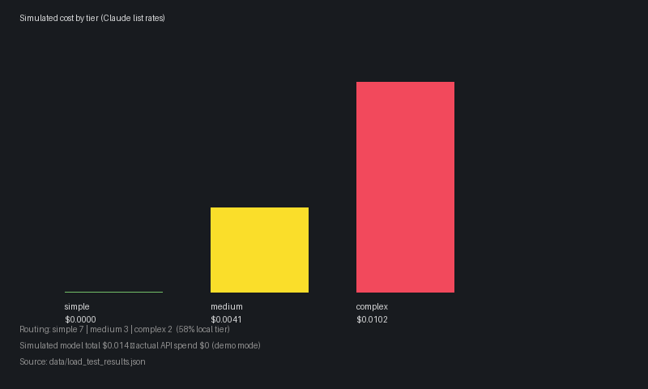

# FinOps AI Gateway

An observable, cost-routing AI gateway: classify query complexity, retrieve with hybrid RAG, route to cheap vs expensive LLM tiers, and expose **tokens, cost, routing tier, and latency** in Grafana + LangSmith.

## 60-second demo

```powershell
copy .env.example .env   # set GROQ_API_KEY + LANGCHAIN_API_KEY
.\scripts\bootstrap_demo.ps1
```

Open **http://localhost:3001** → dashboard **FinOps AI Gateway**. First run ~15–25 min (ingest + load test). See [How to run](#how-to-run) for details.

---

## Problem

Teams shipping RAG + LLM features face two blind spots:

1. **Cost** — every query hits the same expensive model, even for simple factual lookups.
2. **Quality** — retrieval changes (BM25, reranking) are hard to compare without structured eval metrics.

This project treats the gateway as a **FinOps control plane**: route by complexity, measure spend per tier, and score retrieval quality with RAGAS — all visible in Grafana.

---

## Architecture


Editable source: [docs/architecture.excalidraw](docs/architecture.excalidraw)

**One query flows through four steps:**

1. **Classify** — Groq `llama-3.1-8b-instant` → `simple | medium | complex`
2. **Retrieve** — pgvector + BM25 → RRF fusion → cross-encoder rerank → top-k chunks
3. **Route** — tier picks the answer model:
   - `simple` → Ollama `qwen3:4b` (local, $0 actual)
   - `medium` / `complex` → Claude Haiku/Sonnet *or* Groq fallback in demo mode
4. **Observe** — metrics → Pushgateway → Prometheus → Grafana; traces → LangSmith

Ollama runs in Docker Compose by default ([docs/OLLAMA.md](docs/OLLAMA.md)). On Windows with a GPU, stop the compose Ollama container and use host Ollama for faster demos.

---

## Results

Numbers below are from runs on this project’s LangGraph doc corpus. Grafana uses **simulated Claude list pricing** for medium/complex tiers even when Groq answers for free (demo mode). See [routing/pricing.py](src/finops_gateway/routing/pricing.py).

### Tier routing (12-query load test)

| Metric | Value |
|--------|-------|
| Simple tier (local Ollama) | **7 / 12 (58%)** |
| Simulated spend (actual routing) | **$0.015** total |
| Simulated spend (if all complex) | ~$0.062 total |
| **Spend reduction** | **~76%** vs all-complex baseline |
| p50 latency | 56s (CPU/local Ollama — see caveats) |

Source: [data/load_test_results.json](data/load_test_results.json)

### RAGAS — hybrid vs baseline retrieval (8 pairs, k=4)

| Metric | Baseline (cosine) | Hybrid + rerank | Delta |
|--------|-------------------|-----------------|-------|
| context_precision | 0.6042 | **0.7917** | **+0.1875** |
| faithfulness | 0.7690 | 1.0000 | +0.2310 |
| answer_relevancy | 0.7716 | 0.7947 | +0.0231 |

Source: [data/eval/ragas_results_8pair.md](data/eval/ragas_results_8pair.md)

### Grafana panels

After bootstrap, confirm in dashboard **FinOps AI Gateway**:

- **Cost by Tier (USD total)**
- **Routing Decision Breakdown**
- **Retrieval Latency p95**
- **Tokens Used by Tier**
- **RAGAS Scores (baseline vs hybrid)**



---

## How to run

### Prerequisites

- Python 3.11+ and [uv](https://docs.astral.sh/uv/)
- Docker Desktop
- Free [Groq](https://console.groq.com) API key (classifier)
- [LangSmith](https://smith.langchain.com) API key (tracing)

### Quick start

```powershell
git clone <your-repo-url>
cd finops-ai-gateway

copy .env.example .env
# Required: GROQ_API_KEY, LANGCHAIN_API_KEY

.\scripts\bootstrap_demo.ps1
```

Linux/macOS:

```bash
chmod +x scripts/bootstrap_demo.sh
./scripts/bootstrap_demo.sh
```

### What bootstrap does

1. `docker compose up -d` — Postgres, Redis, Prometheus, Pushgateway, Grafana, **Ollama**
2. Pull `nomic-embed-text` + `qwen3:4b` into Ollama
3. `uv sync` → ingest LangGraph docs → demo tiers → 12-request load test
4. `finops-publish-results` — pushes saved RAGAS 8-pair scores + load-test metrics

### Manual steps (optional)

```powershell
docker compose up -d
uv sync
uv run finops-ingest-langgraph
uv run finops-query-gateway --question "What is LangGraph?"
uv run finops-demo-tiers
uv run finops-load-test --requests 12 --concurrency 2
uv run finops-publish-results
```

### URLs

| Service | URL |
|---------|-----|
| Grafana | http://localhost:3001 (admin / admin) |
| Prometheus | http://localhost:9090 |
| Pushgateway | http://localhost:9091 |
| Postgres | localhost:5433 |

### Tests

```powershell
uv sync --group dev
uv run pytest
```

---

## Further reading

| Doc | Topic |
|-----|-------|
| [docs/OLLAMA.md](docs/OLLAMA.md) | Bundled vs host GPU Ollama |
| [docs/RAGAS_EVAL.md](docs/RAGAS_EVAL.md) | Full RAGAS eval workflow |
| [docs/BLOG_DRAFT.md](docs/BLOG_DRAFT.md) | Blog post with real numbers |
| [docs/LINKEDIN_POST.md](docs/LINKEDIN_POST.md) | LinkedIn copy + screenshot |
| [docs/PUBLISH.md](docs/PUBLISH.md) | GitHub push + profile pin checklist |
| [docs/PROJECT_CONTEXT.md](docs/PROJECT_CONTEXT.md) | Architecture reference for contributors |

---

## Caveats

- **Simulated pricing** — Grafana cost uses Claude list rates; actual API spend may be $0 on Groq/Ollama demo mode.
- **Latency** — local Ollama on 4GB GPU or CPU Docker is slow; routing/cost story is still valid.
- **RAGAS scope** — canonical benchmark is **8 pairs**; full 50-pair runs need cloud judge quota or paid API.
