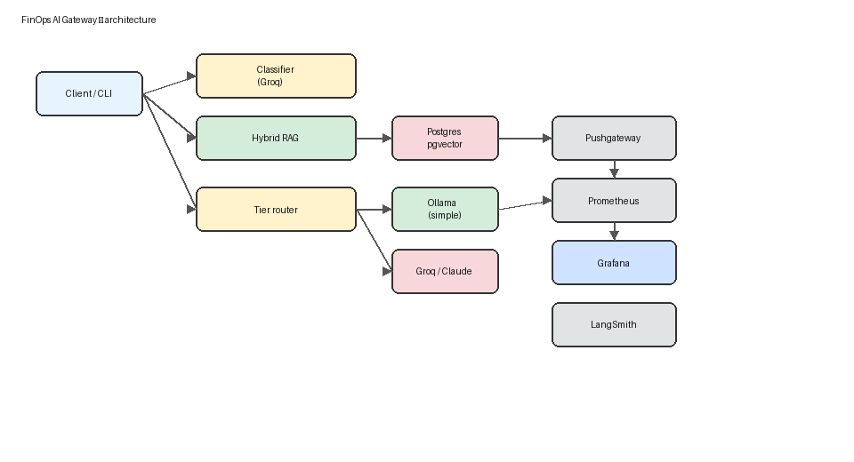

# Blog draft: FinOps for AI gateways (honest version)

**Working title:** *I built an observable LLM gateway — 58% of queries stayed on local Ollama, and I can show you where the seconds go*

---

## Hook

Cloud FinOps tracks EC2 and S3. AI teams often ship one model endpoint with no per-query tier visibility. I built a gateway that **classifies, retrieves, routes, and meters** every query — and I'm precise about what's measured vs modeled.

## What I built

**FinOps AI Gateway** over LangGraph documentation:

1. Groq classifies complexity (`simple | medium | complex`).
2. Hybrid retrieval (BM25 + pgvector + reranker).
3. Simple → local Ollama; medium/complex → cloud fallback (Groq in demo mode).
4. Metrics → Grafana; traces → LangSmith.



## Numbers I stand behind

### 1. Routing — measured

12-query load test from `data/load_test_results.json`:

- **58%** (7/12) routed to **simple** → local Ollama
- This is a **counted routing decision**, not a projection

### 2. Latency — measured (and why p50 looks scary)

| Component | p50 |
|-----------|-----|
| Retrieval | ~2.3s |
| Generation (simple / Ollama) | ~356s |
| Generation (medium+complex / Groq) | ~1–4s |

End-to-end p50 **~276s** because **local generation dominates** on a 4GB GPU — not because retrieval is broken. Grafana now breaks this out in **Latency Breakdown p50**.

### 3. Cost — simulated model, $0 actual spend

Grafana's cost panel applies **Claude list prices × token counts** — a FinOps **what-if model**.

- Simulated tier routing total: **$0.014** (12 queries)
- Simulated all-complex counterfactual: **$0.061**
- **~77% lower in the model** vs sending everything complex-tier
- **Actual API spend in demo mode: $0** (Groq + Ollama)

I'm not claiming measured dollar savings — I'm claiming **observable tier routing + cost modeling**.

### 4. Retrieval quality — pilot RAGAS (n=8)

| Metric | Baseline | Hybrid | Delta |
|--------|----------|--------|-------|
| **context_precision** | 0.60 | **0.79** | **+0.19** |
| faithfulness | 0.77 | 1.00 | *(noisy at n=8)* |

Judge: Groq 8B. Answers: Ollama qwen3:4b. **Eight pairs is directional, not a production SLA.**

## Reproduce

```powershell
copy .env.example .env
.\scripts\bootstrap_demo.ps1
uv run finops-report-results
```

## What I'd do next (without claiming it's done)

- 50-pair RAGAS when judge quota allows
- Live Anthropic key for **measured** medium/complex spend (optional ~$1)
- LangGraph stateful agent with checkpointing

---

*All numbers trace to [data/RESULTS.md](../data/RESULTS.md) and [docs/METHODOLOGY.md](../docs/METHODOLOGY.md).*
